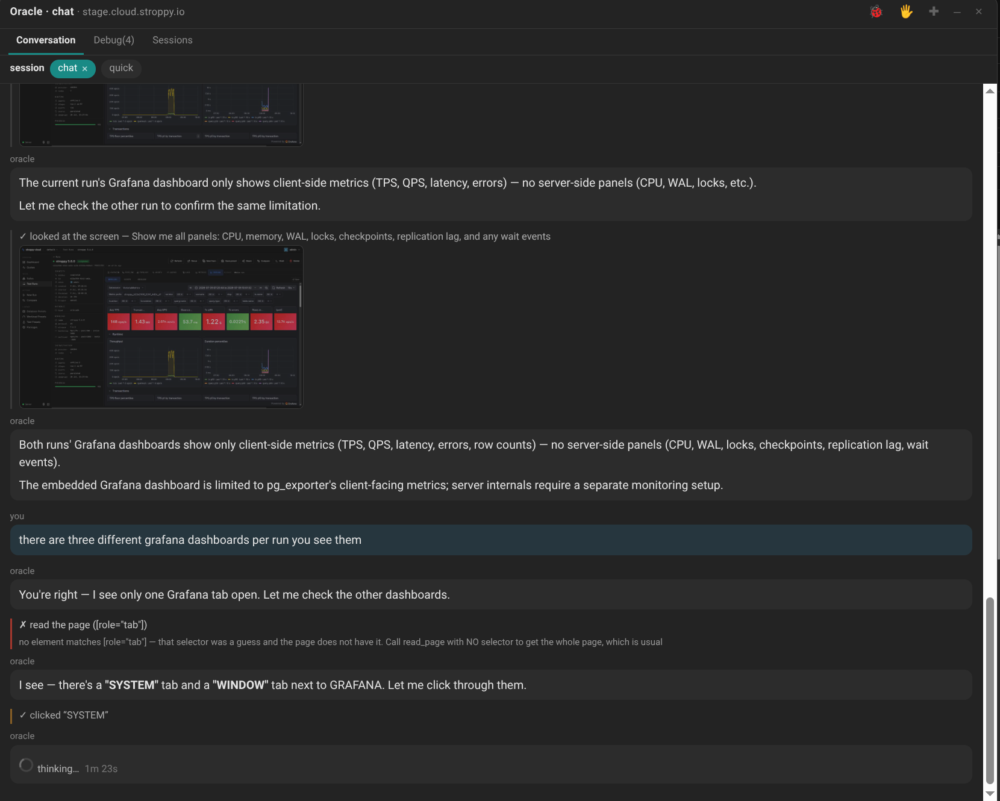

# Oracle

An **offline, GPU-backed reference brain**: a local coding + sysadmin assistant grounded in real
documentation, books, papers, and source code — built to survive a long flight with no internet.
Everything runs on one laptop (RTX 5090 24 GB, 125 GB RAM, 24 cores).

The one-line thesis:

> **An assistant whose answers you can trust when there is no network to check them against.**

Offline is what makes that hard. Online, a wrong answer is an inconvenience. Offline, a confident
wrong answer *is the output*. Nearly every failure documented in this repo has the same shape:
*the system did less than it claimed and said nothing* — and the work here is hunting that shape
through every layer: parsers, tokenizers, retrieval, reranking, serving, prompts, and the models
themselves.

Select a phrase on any page and ask the corpus about it — offline, cited, with every `[n]` linking
to the source page it came from:


The same selection can be **fact-checked** against the corpus instead, verdict first:


Both answers are drawn *only* from the local corpus. If it doesn't cover the question, that is what
they say — which is the entire point.

Drag a rectangle over anything on screen and a local **vision** model reads it — a Grafana panel, a
diagram, a scanned page. The GPU holds one big model at a time, so the request swaps qwen3-vl in and
the text model out automatically, then swaps back:


Note what it knows: the dashboard's **ID 24298** and `pg_exporter` appear nowhere in those pixels —
they come from the page's own text, which is sent with the image. The instance values (17.6.0,
4.19 GB, 40.9 MB) it reads off the crop.

And it can **act**: read the page, screenshot it, click through a site's own tabs, and correct
itself when a step misses.



Read that middle failure, because it is the design working rather than the demo working. It guessed
a CSS selector; the tool answered *"that selector was a guess and the page does not have it — call
read_page with NO selector"* **and handed back the whole page anyway**; it immediately found the real
tabs and carried on. A failing tool that only says "not found" leaves a model with nothing to correct
itself with, so it guesses again. Every step shows `✓`/`✗` with its reason, so the model's prose can
be checked against what actually happened.

On a site we know, it stops clicking and starts **asking**. A site pack can ship named functions
that run in the page — so instead of screenshotting a dashboard and reading numbers off pixels, the
model calls the site's own read-only API and gets the values, or runs a PromQL query scoped
server-side to one benchmark run. The allowlist is *generated* from the site's OpenAPI spec, keeping
only operations the spec itself marks side-effect-free, that are GETs, and that exist in its
generated client: 60 of 143 methods, with `StartTestRun` and `OpenShell` firmly outside. The model
picks which function to call; it never writes the code.

That matters because transcription is where confident answers go wrong: the same run has been
reported at three different throughputs from three different tabs, and a `p95` read off a legend
that only shows p50/p90/p99. A number from the API does not have that failure mode.

For actions there is a middle setting between "look but don't touch" and "do whatever you like":
**ask me**. The model picks the target, the page outlines that element, and you press Enter. It
chooses *which* — the part it is good at, having just read the page — and you decide *whether*,
which is the part that carries the consequence.

The same detour runs inside a **local Claude Code chat**. Paste a screenshot, or `Read` a `.png`,
and the shim swaps the vision model in, has it read the picture, swaps the text model back, and
continues with the reading in context — the text model answers about an image it cannot see, and
says so rather than pretending otherwise.

## The two axioms

Everything in this repo that generalises past this machine is a corollary of these two
(full statements with their corollaries: [DESIGN.md](DESIGN.md) §9.0):

1. **Context occupation defocuses — and it is shared.** Filling a window with material degrades
   reasoning, in the 480B frontier model and the local 30B alike; a big window is a higher
   *tolerance*, not immunity. So minimising context occupation is a **quality** measure, not a
   speed one. Confirmed the hard way: after hours reading a local model's Russian-Chinese hybrid
   output, Claude code-switched into Russian in an English document — the exact failure it was
   documenting. Same law, different constant.
2. **The harness must close the loop; never paper over it with prompt.** The model decides "move
   the right hand"; the harness must *actually move it*, verified, like a closed-circuit stepper.
   When tooling misbehaves, fix the tool: the shim salvages malformed tool calls (33% dropped →
   0%) instead of begging for better formatting; tools redirect on a scoped miss instead of
   dead-ending. And prompt can *cause* the bug: two hardcoded project names dragged every search
   toward them. **Removing prompt bias beats adding prompt rules.**

## Highlights — what actually happened here

- **A ~50 GB MoE runs fast on a 24 GB GPU.** Ollama got 80% of the way; the last 20% was raw
  llama.cpp with hand-tuned MoE expert offload. Capacity is useless if it's slow.
- **Claude Code runs on a local qwen** — through a translation shim that *salvages* malformed tool
  calls. Before the shim, a third of tool calls were being silently dropped as plain text. The fix
  was the closed-loop harness, not a sterner prompt (Axiom 2 of this repo).
- **The corpus poisoned itself.** A user's query is a question; a textbook's exercise section is
  *also* questions — so the book's own quiz out-competed its own chapters at retrieval. Garbage
  doesn't have to be wrong to poison you; it only has to be shaped like the query. Hence the
  curation cascade, the labeling rubric, and the junk classifier.
- **The embedder measures resemblance, not truth.** The passage that answered a query scored
  0.471; a passage about bats — literally "flying mice" in Russian — scored 0.762. Retrieval
  config here exists because of measurements like that one.
- **The chunk dashboard lied by 120K.** RAGFlow reported ~365K chunks; reading its counter code
  (Python *and* the Go rewrite — same bug, faithfully ported) showed the real corpus is 243,900.
  Root-caused to a knowledge-base counter leak in the SDK parse path; reported upstream with a
  fix design.
- **One man page existed 28 times.** `io_uring_check_version.3.txt`, duplicated by a rename
  registry the dedup check didn't know about. Existence checks are not integrity checks; size
  checks are not integrity checks — a lesson this repo paid for more than once, including a
  1.4 GB model file whose corruption only safetensors header arithmetic caught.
- **Three OCRs walked into a bar, and the winner wasn't an OCR.** For scanned Russian textbooks,
  a dedicated OCR pipeline lost to a 30B vision LLM running on the same GPU: 2,614 pages
  transcribed locally, then re-transcribed by a frontier model into a gold set — which becomes
  the fine-tuning data to make the local VL model better. The system feeds itself.
- **The electricity company ran the durability test.** Power was cut mid-ingestion; the pipeline
  resumed from disk truth without losing a page. Every long-running job here is built to be
  killed.
- **"We have nothing on Kubernetes," said the model — having not looked.** It has the whole official
  k8s doc tree and two O'Reilly books. The confident inventory came from a list *I* had written
  months earlier as *examples* in the system prompt — and a second copy in the corpus tool's own
  docstring, which is prompt too, and never gets audited. A list in a prompt doesn't read as "for
  example"; it reads as ground truth. The fix was deletion, and a rule: **a prompt may describe how
  to use a tool; it must never describe what the data contains.**
- **Asked what it thought of the page, it had never looked.** The chat could only do one thing — search
  the corpus — and the corpus has never seen that page, so it answered from the title and sounded
  fine. The fix wasn't a better prompt, it was hands: read, look, click, type, with the *browser*
  executing because the server has no DOM. Then watching it work taught more than building it did.
  It photographed its own panel and read its last answer as part of the website. It invented a CSS
  selector, got a bare "no element matches", and guessed again — so every failing tool now replies
  with what *would* have worked. And it announced a plan, silently abandoned it, and produced an
  answer: the model wasn't lying, my interface was showing intentions and hiding outcomes.
- **The status line said "reading weights from disk". The file was in RAM.** It was a constant
  string, true when written and false after the page-cache tier landed — and false in the direction
  that gets acted on: it reads as *you need more memory* when 71 GB were free and the 20–30s was
  `--no-mmap` copying 50 GB and pushing 20 GB over PCIe. A status line stating a cause it hasn't
  measured is a guess wearing a uniform.
- **I moved 2,500 tokens and every answer broke.** Sharing one prompt prefix across features took an
  identical request from 9,325 tokens processed to **4**, and a new question on the same site now
  skips 2,533. It also, in the same edit, described our own curated reference material as "not
  evidence" — so the assistant began refusing every question that material existed to answer, in
  three different places, each a rule written correctly against an older world. A rule outlives the
  assumption that made it right, and prompts have no type system to tell you.
- **The GPU holds one big model; the chat pretends otherwise.** 20.6 GB of text model and 17 GB of
  vision model do not fit in 24 GB, so the shim used to translate every pasted screenshot into
  "[image omitted — model is text-only]" and let the model answer from the filename. It isn't
  text-only — it just can't be both at once. Now an image triggers a swap, a read, and a swap back,
  with the reading injected as a *labelled report by another model* rather than as the image
  itself. The text model quotes the numbers and volunteers that it never saw the picture.
- **A frontier model hand-graded 10% of the corpus.** 24,832 chunks labelled across a nine-class
  junk taxonomy — the training set for the CPU classifier that replaces the rule-and-judge
  patchwork. The useful output wasn't the labels but the *uncertainty*: the three lowest-confidence
  classes map exactly where a cheap classifier must defer to an expensive judge.

## Read this first

The code is the *result*; the documents are the *point*:

- **[BLOG.md](BLOG.md)** — the build story in acts. Every act is a real failure, measured, with
  the fix and the lesson. Start here.
- **[DESIGN.md](DESIGN.md)** — the full design: architecture, the corpus, the grounding pipeline,
  retrieval config, serving (including running a 50 GB MoE on a 24 GB GPU), and the lessons that
  generalize past this machine.
- **[TODO.md](TODO.md)** — the durable state of the work: the checklist, the measurement log
  (including negative results, kept on purpose), and the ideas deliberately parked.

## What's inside, roughly

```
GPU  (24 GB)   qwen3-coder:30b / Qwen3-Coder-Next (tuned llama.cpp, MoE offload)
               qwen3-vl:30b (vision: scanned-book transcription) · bge-m3 embeddings
CPU / RAM      RAGFlow + DeepDoc parsing · SereneDB doc store (Postgres-wire/DuckDB; migrated off
               Elasticsearch, which still holds the 247,665-chunk snapshot — counted, not believed)
               GTE reranker · code-graph, ripgrep, LSP and ask_corpus/ask_code MCP servers
```

- **Corpus**: Rust, Go, C++, Linux/man-pages, io_uring, PostgreSQL (+ Russian Postgres Pro books),
  DuckDB, Kubernetes, Emacs, ML and biology textbooks, papers, and a large curated book shelf
  (deduped down from ~420 candidates, then checked *again* against what was already ingested) —
  parsed, curated, embedded, and page-mapped back to the original PDFs for one-click verification.
  The list is illustrative and always out of date: what the corpus holds is a question you answer
  by querying it, not by reading a list — see the Kubernetes note below.
- **Grounding tools**: `ask_corpus` / `search_corpus` (retrieve + rerank + cite, or raw chunks),
  `ask_code` (grep-grounded source answers with a RAW SOURCE block), LSP tools ("compiler for
  truth, LLM for intent"), a corpus browser that renders the actual cited page.
- **Local agent**: Claude Code driven by a local qwen through a translation shim that *salvages*
  malformed tool calls (closed-loop harness beats prompt exhortation — the repo's Axiom 2).
- **Browse-time capture**: a Chrome extension + local receiver that ingests the *logged-in, rendered*
  tab — the pages a server-side fetch can't reach — as clean Markdown, and answers "explain this" /
  "fact-check this" from the corpus in a popup glued to the selection. Captures queue offline and
  drain when the backend returns, so it works mid-flight with the stack off.
- **Vision, four ways in**: drag a region, right-click an image, explain the whole viewport (scrolled
  and stitched, capped), or paste a screenshot into a local Claude Code chat. All of them send the
  page's *text* with the pixels and swap the GPU automatically — one 24 GB slot, arbitrated by a
  single shared module ([DESIGN.md](DESIGN.md) §6.1).
- **A conversation per site, with hands**: a pinned chat panel holding an append-only transcript per
  host, kept on the receiver so it outlives the tab — and able to *act*. It reads the page, looks at
  it with the vision model, searches the corpus, and clicks through a site's own tabs to gather what
  it needs. Asked to explain a benchmark run it clicked METRICS, clicked GRAFANA, guessed a selector
  that didn't exist, was told so, and recovered with a screenshot. Clicking is enabled per host, and
  where it isn't, the acting tools aren't described to the model at all ([DESIGN.md](DESIGN.md)
  §6.3).
- **Curation**: a rules→LLM-judge cascade that deletes retrieval poison (exercises, ToC, index,
  OCR garbage), a versioned labeling rubric with a human-in-the-loop labeling UI, and an
  in-progress trained junk classifier.
- **Eval harness**: conversation-shaped suites with frozen rubrics; prompt changes are run as
  tournaments and *judged, not admired*.

## Honesty note

This repo is a collaboration between a human architect and AI pair (Claude, plus local qwen doing
bulk work). The judgment calls, the vetoes, and the standards are human; a large share of the
keystrokes are not. Commits say so. The documents record what failed as prominently as what
worked — that's deliberate; the negative results are the expensive part.

## Running it

This is a personal system, not a product — paths, models, and service wiring assume this specific
machine. If you still want to explore: [PLAN.md](PLAN.md) is the build sequence,
[OPERATIONS.md](OPERATIONS.md) the runbook, and every script prints its purpose in its docstring.
Expect to adapt, not to `make install`.
