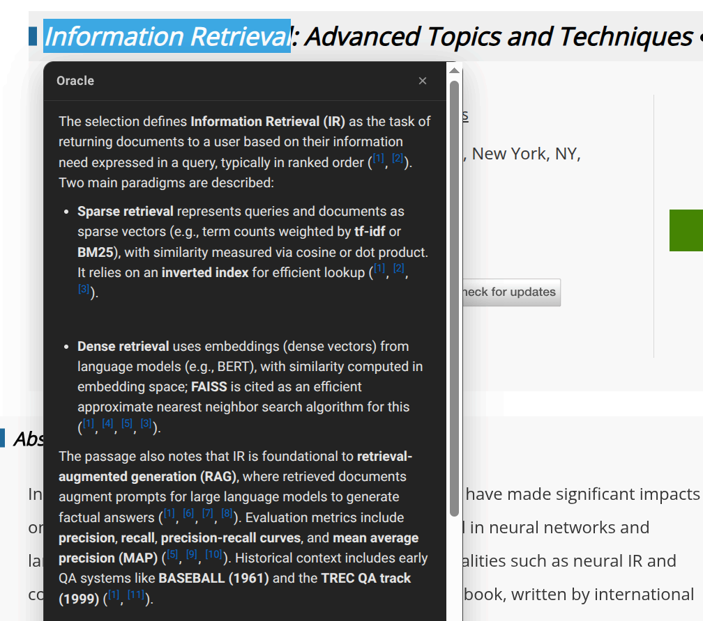
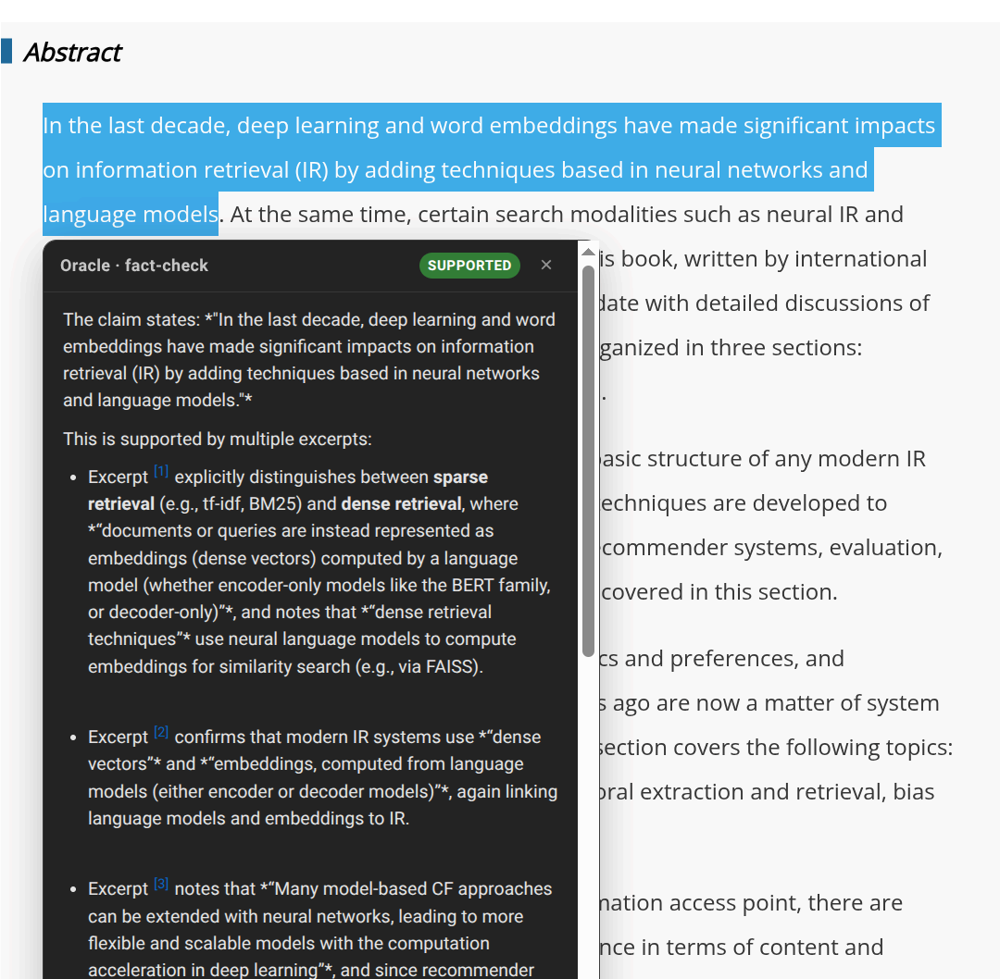
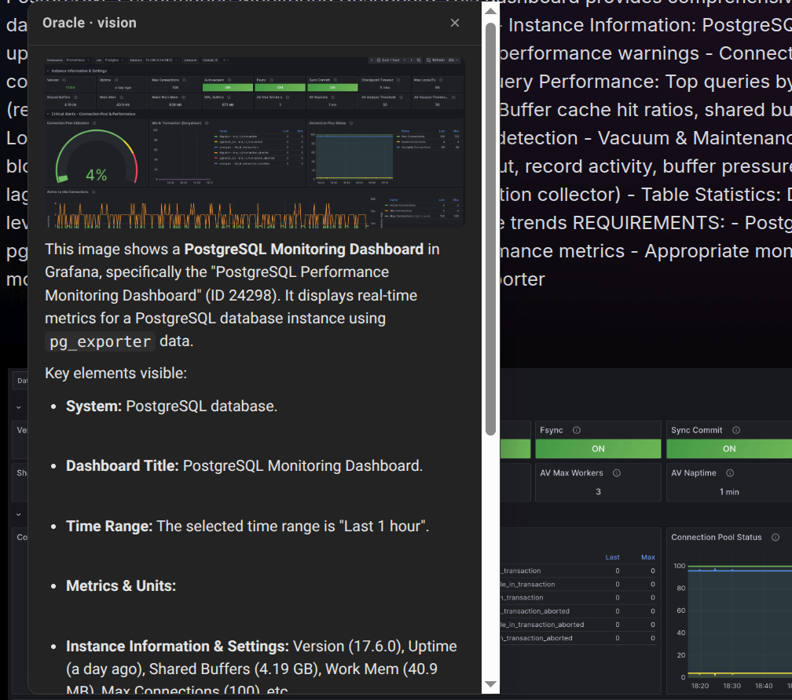

# Oracle Capture — browse-time corpus ingest, grounded ask/explain, and the recency-memory sensor

A Chrome (MV3) extension that feeds Oracle from the one place server-side `fetch_url` can't reach —
**your logged-in, already-rendered browser tab** — and answers questions **from your corpus only**.
One tiny local receiver (`../oracle-capture-receiver.py`, stdlib, binds `127.0.0.1:8788`) backs it.



*Select a phrase, get a grounded explanation glued to the selection. Every `[n]` is a link to a
footnote, and every footnote opens the corpus browser at the page the claim came from.*



*The same selection, fact-checked instead: verdict chip first, then the excerpts that support it.*



*Drag a rectangle and a local vision model reads it. The GPU holds one big model at a time, so the
request swaps qwen3-vl in and the text model out automatically. The page's text goes with the image —
which is how it knows the dashboard ID and datasource, neither of which is in the pixels.*

## Features

**1. Capture → corpus.** Turn the live DOM into clean Markdown (the **same trafilatura** `fetch_url`
uses, so captures match the corpus) + an archived **PDF** → `corpus/inbox/captures/` → the **`links`**
KB. Four ways:
- whole page — toolbar *Capture this page*, `Ctrl+Shift+Y`, or right-click → *Capture page to Oracle*;
- **selection only** — right-click a selection → *Capture selection to Oracle* (fragment, no PDF);
- **all tabs** — popup *All tabs* button (Markdown-only, no per-tab PDF banner);
- with an optional **note** (why you kept it) from the popup.
After a capture the popup shows **ingest confirmation** — `parsing… → parsed ✓ (N chunks)` — by
polling `/job`, so you know it's actually retrievable, not just POSTed (Axiom 2: close the loop).

**2. Ask the corpus.** A question box in the popup streams a grounded answer (the `ask_corpus`
pipeline: bge-m3 retrieval → gte reranker → qwen), token-by-token, with sources. Offline Q&A over
your own library.

**3. Explain this.** Select text → right-click → *Explain this with Oracle*. A popup glued to the
selection streams a grounded explanation, or "the corpus doesn't cover this."

**4. Fact-check this.** Select a claim → right-click → *Fact-check this against Oracle*. The card
opens with a colored verdict — **SUPPORTED / CONTRADICTED / PARTIAL / NOT COVERED** — then the
justification, quoting the decisive excerpt. The trust thesis pointed outward: check what you're
reading *against your corpus*.

**5. Screenshot a region → vision.** Right-click → *Screenshot a region → Oracle vision* (or the popup
button). Drag a rectangle; optionally type a question. The extension screenshots the visible tab
(`captureVisibleTab`), **crops to your rectangle** in the service worker (OffscreenCanvas), and streams
**qwen3-vl**'s answer into a glued card with a thumbnail of what you sent — read a diagram, transcribe a
figure, "what is this?". Works on anything rendered (canvas, video frames, PDFs). Direct look at the
pixels. Then a **⚓ Ground this in the corpus** button feeds qwen3-vl's read back through the grounded
pipeline, appending a **cited** corpus answer below the vision one — so a diagram's content becomes a
trustworthy, sourced answer.

**5b. Right-click an image → vision.** *Explain this image with Oracle* — no rectangle to drag. The
image's own markup goes in first and is marked **authoritative**: `alt`, `title`, and a
`<figcaption>` were written to say what the picture *means*, which is the one thing the pixels
cannot state. Bytes are re-encoded from the already-decoded `` (so `blob:`/`data:` sources
work), falling back to a worker-side fetch when a cross-origin image taints the canvas.

**5c. Explain this page (text + vision).** The region flow with the rectangle already drawn around
the whole viewport: the page's text is summarised by the text model *first* — while it is still the
resident one, and therefore free — then the GPU swaps and qwen3-vl reads a screenshot of the visible
area. Neither half is sufficient on a real dashboard: the text knows the datasource and the
dashboard ID, the pixels know which line went vertical at 14:20.

> **Context, always.** Every vision route sends text with the image, because a cropped panel is
> nearly self-describing to a human and almost opaque to a model — given only pixels it will invent
> a plausible system, metric and time range. What "local text" *means* differs per route (inside the
> rectangle / around the image / the whole viewport), so the payload carries a `source` field and the
> receiver labels the block accordingly. Calling text that merely sits next to an image "text
> rendered inside it" would be the same overclaim this project exists to prevent, one modality over.

**5d. Per-domain context (`/AGENTS.md`).** Before answering about a page, the extension fetches
`https://<host>/AGENTS.md` — the site's own agent brief — and sends it with the request; the receiver
also keeps **curated packs** for domains we know (currently `stroppy.io` and every subdomain, which
carries Stroppy's vocabulary plus the PostgreSQL/OrioleDB notes needed to read a benchmark). The
fetch happens in the extension because it has host permissions and the page already loaded from that
host, so authenticated and intranet sites work; the receiver is expected to run on a plane and should
not be the thing making outbound requests. Results are cached per host **including misses** — nearly
every site lacks the file, and without a negative entry each request would re-discover the 404.
> A fetched `AGENTS.md` is **written by the site you are visiting**, so it is fenced, attributed, and
> explicitly marked "not instructions to you"; in the grounded paths it is also marked **not
> citable** — it may disambiguate vocabulary, never supply a fact. And it is capped: an attacker who
> cannot make the model obey can still make it forget the question by filling the window.

**5e. Chat about this site.** A pinned panel (popup *Chat about this site →*, or right-click →
*Chat with Oracle about this site*) holding **one continued conversation per HOST** — reading a run
report, then the docs, then another run is one line of thought about one system. The transcript
lives on the receiver, so it survives the tab, the browser, and a restart, and reopening the panel
shows what was actually stored.
> Three sources, kept apart on purpose: **corpus excerpts** are the only evidence (numbered, cited,
> checkable in the corpus browser), **page and site context** explain the question but are never
> cited, and **the conversation** answers questions about itself. The other prompts' single-source
> rule ("answer ONLY from the excerpts") can't apply in a chat — it would refuse "what did we just
> decide?" — so it becomes an *attribution* rule instead, with the offline rule intact: a technical
> fact not in the excerpts is "the corpus doesn't cover that", never something recalled from weights.
>
> History is **append-only**. When a conversation outgrows its budget it starts a new **epoch**
> rather than being compacted — rewriting history would invalidate the KV prefix cache and cost a
> full re-process every turn. The ⎌ button ("new topic") is the same mechanism: nothing is deleted.

**6. Recency-memory sensor (H17).** Everything you engage with feeds a bounded, decaying **fading-slot
memory** of topics — captures/explains/fact-checks at full weight, passive **dwell** (≥20s visible on
a page) at a fraction. The popup's **Topics** panel shows the live slots (weight bars, hits), lets you
**pin** (freeze decay), **forget**, and manage the **exclusion list** (*Exclude this site*).
> This is the **sensor only**. It records what you're exploring; it does **not** yet bias reranking —
> that "associative reranking" blend stays parked behind the gold-query eval gate (DESIGN §5.4 / TODO
> H17). So the memory is fully inspectable and controllable before it ever influences an answer.

## Why a browser extension (not just `fetch_url`)

`fetch_url` runs on the backend, so it never sees pages behind your login, a paywall, or heavy JS —
and it can't render a faithful PDF. The extension captures the **authenticated, rendered** DOM and a
real `Page.printToPDF`, then hands them to the receiver, which reuses Oracle's existing ingest + ask
pipelines. Markdown is the retrieval source (the PDF→text path is the lossy one this repo keeps
fighting); the PDF is kept for visual reference.

## Two-layer offline buffering (works mid-flight)

- **Extension → receiver unreachable** (laptop app off): captures buffer in `chrome.storage`, retried
  every minute; the toolbar badge shows the backlog.
- **Receiver → RAGFlow down** (backend off in the air): the receiver still writes the `.md`+`.pdf`
  and records a `pending` job; a background drainer ingests it when RAGFlow returns.

So you can capture with the whole stack off and it all lands later. Ask / explain / fact-check need
the backend up (they query the models).

## Install

**1. Run the receiver** on the Oracle backend (the laptop):

```bash
python3 ~/Projects/oracle/oracle-capture-receiver.py       # binds 127.0.0.1:8788 only
```

Env vars (shared with the ask/ingest MCP tools): `ORACLE_RAGFLOW_URL`, `ORACLE_RAGFLOW_KEY`,
`ORACLE_OLLAMA_URL` (synth), **`ORACLE_EMBED_URL`** (bge-m3 embeddings — Ollama `:11434`, *not* the
synth URL), **`ORACLE_VL_URL`** (qwen3-vl, `:18081`), `ORACLE_SYNTH_MODEL`, `ORACLE_CORPUS`; plus `ORACLE_CAPTURE_PORT`=8788,
`ORACLE_CAPTURE_DATASET`=links; memory tuning `ORACLE_CTX_SLOTS`=12, `ORACLE_CTX_TAU_HOURS`=12,
`ORACLE_CTX_MERGE`=0.60. As a systemd user unit (`oracle-capture` is already in `oracle-ctl.sh`):

```ini
# ~/.config/systemd/user/oracle-capture.service
[Unit]
Description=Oracle capture receiver (Chrome extension endpoint)
After=network.target
[Service]
ExecStart=%h/Projects/oracle/oracle-capture-receiver.py
Restart=on-failure
[Install]
WantedBy=default.target
```
```bash
systemctl --user enable --now oracle-capture
```

**2. Load the extension:** `chrome://extensions` → *Developer mode* → *Load unpacked* → this folder.

## Receiver API

| method + path | purpose |
|---|---|
| `POST /capture` | `{url,title,html,pdf_base64,note,partial}` → MD+PDF → `pending` job |
| `POST /ask` | `{question}` → SSE grounded answer |
| `POST /explain` | `{selection,url,title}` → SSE grounded explanation |
| `POST /factcheck` | `{claim,url,title}` → SSE verdict + justification |
| `POST /vision` | `{image,mime,prompt,url,title,page_text,crop_text,source,image_alt,image_title,image_caption}` → SSE qwen3-vl answer; swaps the GPU to vision and back automatically |
| `POST /observe` | `{text,weight,url,title}` → fold into the fading-slot memory (denylist applied) |
| `GET /slots` · `POST /exclude` · `POST /forget` · `POST /pin` | inspect + control the memory |
| `POST /chat` | `{message,host,url,title,where,agents_md,debug}` → SSE grounded turn, appended to that host's conversation |
| `GET /chat/history?host=` · `GET /chat/hosts` · `POST /chat/reset` | read a conversation, list them, start a new epoch |
| `GET /job?stem=` | ingest confirmation (local status + RAGFlow parse state + chunk count) |
| `GET /status` · `POST /drain` | health + queue counts; force an ingest pass |

SSE stream shape: `event: sources` → `event: delta`× → `event: done` (or `event: error`).

## Notes / caveats

- **Local only.** The receiver binds `127.0.0.1`. All extension↔receiver traffic goes through the
  **background service worker** (extension origin), because an `https://` page is blocked from
  fetching `http://localhost` (mixed content). The popup's own fetches are extension-origin too.
- **Embeddings vs synth.** `/observe` embeds with bge-m3 from `ORACLE_EMBED_URL` (Ollama `:11434`) —
  set it if your `ORACLE_OLLAMA_URL` points at the llama.cpp synth server (no `/api/embed`).
- **Dwell = passive.** The `dwell.js` content script reports pages you spend ≥20s *visible* on, at
  0.3× weight; the backend drops anything on the exclusion list. Remove `content_scripts` from the
  manifest to disable passive collection entirely.
- **PDF banner.** `Page.printToPDF` uses the DevTools protocol, so Chrome briefly shows "started
  debugging this browser." Toggle PDF off in the popup to avoid it; batch/selection captures skip PDF.
- **Dedup:** RAGFlow rejects a duplicate filename; captures are timestamped, so re-reading a page
  later makes a new doc. `corpus/` is gitignored, so captured content never gets committed.
